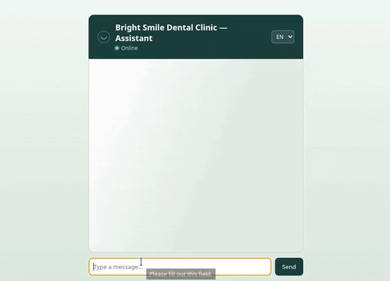

# AI Customer Support Chatbot (RAG-powered)



**Live demo:** https://ai-support-chatbot-oqrx.onrender.com
*(Free-tier hosting — first load may take up to a minute if the service was idle.)*

A customer-support chatbot backend for a dental clinic, built with FastAPI, ChromaDB, and the Claude API. Instead of hard-coding business information into a single prompt, the bot retrieves the most relevant passages from a document collection for each question — a full Retrieval-Augmented Generation (RAG) pipeline.

## Evolution note

This project started as a simpler bot with a single hard-coded JSON config (`business_configs/*.json`) driving the system prompt — see commit history. That approach breaks down once a business's knowledge base grows past a single FAQ page: you can't fit an entire policy manual into a prompt. This version replaces the static config with a proper retrieval pipeline: documents are chunked, embedded, and stored in a vector database, and only the passages relevant to *this specific question* are retrieved and passed to the model.

## How it works

**Indexing (offline, run once via `build_index.py`):**
1. Every `.txt` file in `documents/` is split into paragraph-level chunks
2. Each chunk is embedded and stored in a persistent ChromaDB collection

**Query (runtime, every request):**
1. Client sends `{session_id, message}` to `POST /api/chat`
2. `retriever.py` embeds the question and finds the 3 most similar chunks in ChromaDB, along with a similarity-distance score for each
3. `chat_service.py` filters out chunks whose distance exceeds a calibrated threshold. If nothing passes, the model is told explicitly that it has no relevant information, instead of being handed weak or irrelevant context
4. Otherwise, it builds a system prompt combining a small persona config (`persona.json`: name, business identity, tone) with the surviving chunks
5. The full conversation history (for that session) plus the fresh system prompt is sent to Claude
6. The reply is returned and appended to session history

### How the confidence threshold was chosen

Rather than picking an arbitrary number, the threshold was calibrated against real ChromaDB distance scores: relevant queries returned distances in the 0.56–0.84 range, while an unrelated query ("what is the capital of France?") returned 1.87–1.95. The threshold (1.2) sits in the gap between these two clusters.

## Tech stack

- **Backend:** FastAPI + Uvicorn
- **Vector database:** ChromaDB — supports both embedded (local file, default) and client-server modes via `CHROMA_MODE` in `.env`. The live demo intentionally runs in local mode: a second always-on service isn't worth the added reliability risk on free-tier hosting for a single-instance portfolio demo, but the client-server path is implemented and tested (`chroma_client.py`).
- **LLM:** Claude API (`anthropic` SDK)
- **Frontend:** Vanilla HTML/CSS/JS, served directly by FastAPI (no build step, no separate server)
- - **Concurrency safety:** each session's conversation history is protected by a per-session lock, preventing race conditions when a client sends overlapping requests (caught via a concurrent `curl` test during rate-limit testing).

## Project structure

ai-support-chatbot/
├── backend/
│ ├── main.py # FastAPI routes, CORS, serves frontend/ as static files
│ ├── chat_service.py # Session memory, confidence-filtered RAG prompt, Claude API calls
│ ├── chroma_client.py  # Switches between local (embedded) and http (client-server) ChromaDB
│ ├── retriever.py # Embeds a query and searches ChromaDB
│ ├── build_index.py # One-time script: chunks documents/, builds the ChromaDB index
│ ├── models.py # Request/response schemas
│ └── config.py # Reads API key + model name from .env
├── documents/ # Source knowledge base (plain text files)
├── chroma_db/ # Generated vector index (gitignored, rebuilt via build_index.py)
├── persona.json # Bot identity: name, business name, tone
├── frontend/
│ └── index.html
├── requirements.txt
└── .env.example


## Getting started

```bash
git clone <https://github.com/ezizabdyyevv/ai-support-chatbot>
cd ai-support-chatbot
python3 -m venv .venv
source .venv/bin/activate
pip install -r requirements.txt

cp .env.example .env
# then edit .env and add your ANTHROPIC_API_KEY (console.anthropic.com)

cd backend
python build_index.py       # builds the vector index from documents/
uvicorn main:app --reload --port 8000
```

Open `http://localhost:8000` — FastAPI serves both the API and the chat UI from the same origin.

## Known limitations

- **Session storage is in-memory** — conversations are lost on server restart.
- **Chunking is paragraph-based** (splitting on blank lines) — works well for these structured documents, but a production system would likely use a more robust, size-aware chunking strategy for arbitrary documents.
- **No re-ranking step** — the top-3 chunks from vector similarity are filtered by distance but not re-ranked. For a larger document collection, a dedicated re-ranking model would likely improve precision further.

## What I'd add next

- Log queries that fall below the confidence threshold, to spot recurring gaps in the knowledge base
- Multilingual Support (including Russian + Georgian + Turkish)
